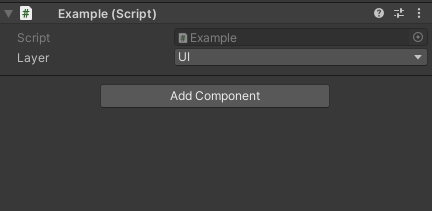
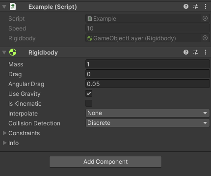
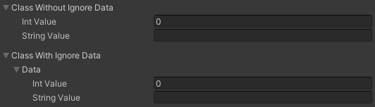
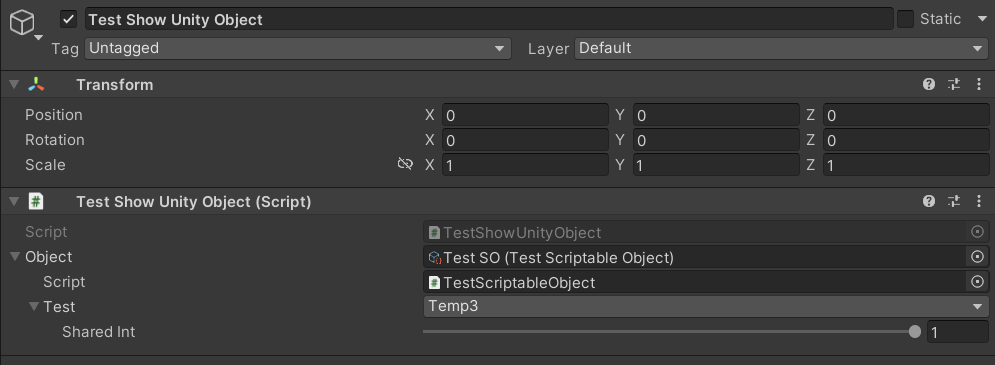

# MiscUtilities
Different utility classes for my other packages to work with.

## Add to project:
To add this package to the project, follow these steps:
1) Open PackageManager;
2) Select "Add package from get URL";
3) insert this link `https://github.com/Paulsams/MiscUtilities.git`

## Dependencies
- Used by:
    + ChoiceReferenceAttribute: https://github.com/Paulsams/ChoiceReferenceAttribute
    + RepairerSerializeReferences: https://github.com/Paulsams/RepairerSerializeReferences
    + SearchableAttribute: https://github.com/Paulsams/SearchableAttribute

## Additional tips
If you do not have a name conflict with my utilities, then you can make my namespace be added to the script automatically:
1) Create a folder "ScriptTemplates" in the root of the project;
2) Create a file with the name: "81-C# Script-NewBehaviourScript.cs";
3) And replace all the text in it with this text (one tab before #ROOTNAMESPACEBEGIN# is required):
```cs
using System.Collections;
using System.Collections.Generic;
using UnityEngine;
using Paulsams.MicsUtils;

    #ROOTNAMESPACEBEGIN#
public class #SCRIPTNAME# : MonoBehaviour
{
    
}
#ROOTNAMESPACEEND#
```

____

## Different Custom Editors
  
1) GameObjectLayer is a structure that allows you to select a layer in the inspector without bit shift operators, that is, for comparison with GameObject.layer;
  


2) ReadonlyField is an attribute so that you can see the value in the inspector, but not change it (but, as I understand it, it only works on non-custom types that do not have their own PropertyDrawer. And I think this because the custom PropertyDrawer redraws what ReadonlyAttribute called).
  


3) IgnoreAttribute - allows you to ignore the field itself and immediately draw all child fields.



3) ShowUnityObjectAttribute - allows you to draw a dropdown inside which the UnityEngine.Object fields will be drawn. \
For example: ScriptableObject.



# Scripting API
To open scripting API documentation, follow this [link](https://paulsams.github.io/MiscUtilities/api/Paulsams.MicsUtils.html).
